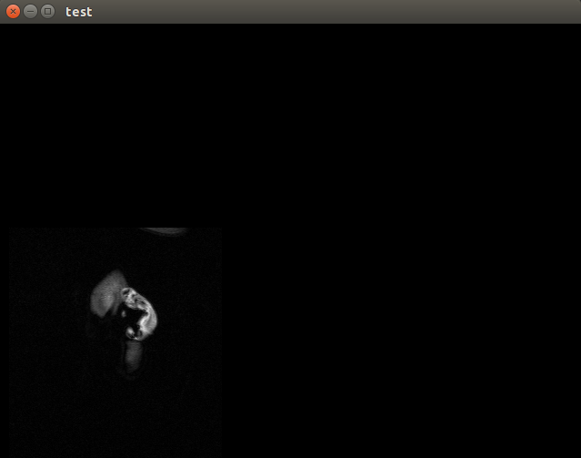
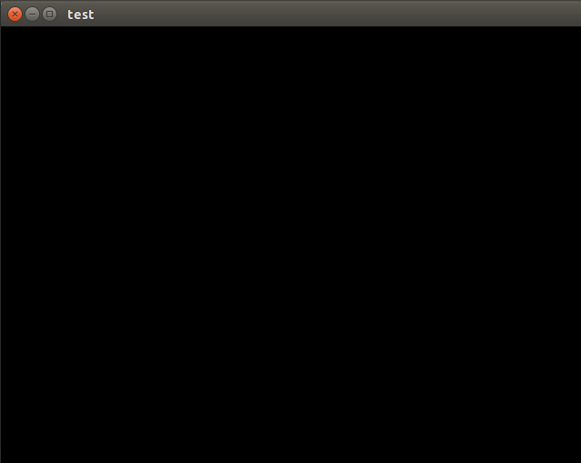

This project was created to help resolve issue https://github.com/Slicer/Slicer/issues/5220


# Build

```
cmake \
  -DQt5_DIR:PATH=$Qt5_DIR \
  -DVTK_DIR:PATH=$VTK_DIR \
  ../slicer-issue-5220
```

# Usage

```
./test
```

or

```
./test --with-DisplayLocationToBackground
```

# Notes

| | VTK@master | VTK@2021768f7| VTK@a4adf3805 |
|---|----|---|---|
| with SetDisplayLocationToBackground()| :x:  |  :x: | :heavy_check_mark: | 
| without SetDisplayLocationToBackground()|  :heavy_check_mark:  | :heavy_check_mark: |:heavy_check_mark: | 


Regression was introduced in [VTK@2021768f7](https://github.com/Kitware/VTK/commit/2021768f7f1eb07ba19ef06e418f8a042d8b04b5)

References:
* [VTK@2021768f7](https://github.com/Kitware/VTK/commit/2021768f7f1eb07ba19ef06e418f8a042d8b04b5)
* [VTK@a4adf3805](https://github.com/Kitware/VTK/commit/a4adf3805e29e130f51bc6637212739e07939b5a)
* [VTK@2021768f7](https://github.com/Kitware/VTK/commit/2021768f7f1eb07ba19ef06e418f8a042d8b04b5)


# Expected vs Invalid

* Expected rendering:



* Invalid rendering:



# VTK history

```
* 2021768f7f - (HEAD, refs/bisect/bad) Fix issues with jogl on osx improve state cache (5 months ago) <Ken Martin>
*   a4adf3805e - Merge topic 'HeuristicPrefilter' (6 months ago) <Michael Migliore>
|\  
| * 27731b642c - Heuristic to adapt the number of samples of vtkPrefilterTexture (6 months ago) <Paul Lafoix>
* |   c7caa9d770 - Merge topic 'wrapper-compiler-extension' (6 months ago) <David Gobbi>
|\ \  
| * | 3d69400935 - Allow gcc, clang extension checks in wrappers (6 months ago) <David Gobbi>
* | |   3acbdd1b85 - Merge topic 'vulkan_tweaks' (6 months ago) <Ken Martin>
|\ \ \  
| * | | 00525a29f9 - Make scene graph apply virtual, win32 setsize/position (6 months ago) <Ken Martin>
|/ / /  
* | |   784183bede - Merge topic 'fix_resolve_reesize' (6 months ago) <Ken Martin>
|\ \ \  
| |_|/  
|/| |   
| * | 516fc4d12b - add a missing resize in the Frame() method (6 months ago) <Ken Martin>
[...]
```
